# Eindproject API Development
## Arne Madalijns - r0937871

### Gekozen thema
Om toch een beetje in de kerstsfeer te blijven heb ik gekozen voor een API die alle pakjes van de Kerstman opslaat.
### Uitleg over mijn API
Deze API biedt een interface voor het beheren van een lijst met cadeaus. Met de API kunnen gebruikers cadeaus toevoegen, verwijderen, bijwerken en weergeven. De API maakt gebruik van FastAPI, waardoor het mogelijk is om snel en efficiënt endpoints te definiëren.

Door gebruik te maken van Pydantic-modellen zorgt de API voor de validatie van gegevens, zoals de naam en categorie van het cadeau. Bovendien maakt de integratie van een SQLite-database het mogelijk om de cadeaulijst persistent op te slaan en te beheren. Deze API maakt gebruik van REST, waardoor gebruikers gemakkelijk toegang hebben tot de endpoints.

### Link naar hosted API
https://apidev-eindproject-service-amadalijns.cloud.okteto.net/cadeaus

### Inloggegevens
username: admin 
password: admin

(zelf een user aanmaken is ook een optie)

### Extra uitbreidingen
Deze API heb ik een mooie en professionele styling gegeven zodat het voor gebruikers makkelijk is deze API te gebruiken. Dit alles wordt gehost op Netlify via de volgende link:
https://apidev-eindproject-am.netlify.app/

### Aantoonbare werking
Toon alle cadeaus: 
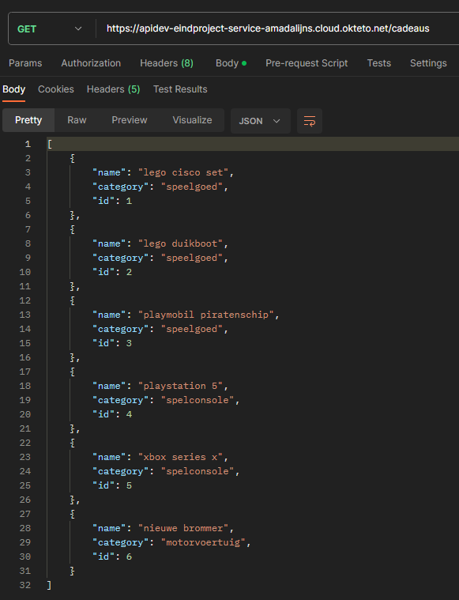

Toon cadeau via ID: 
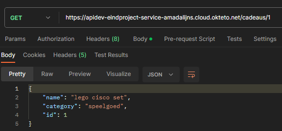

Toon cadeau via categorie: 
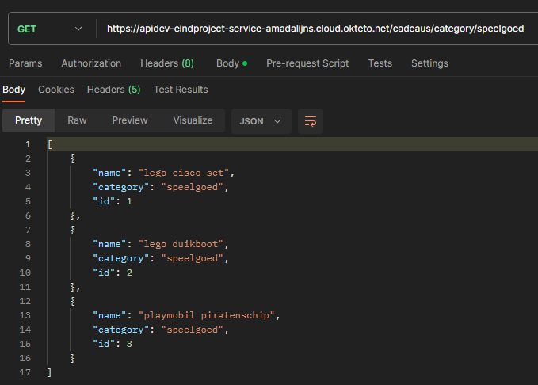

Maak een nieuw cadeau aan: 
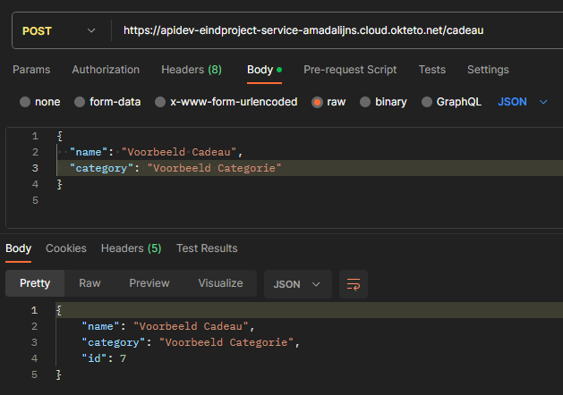

Pas een bestaand cadeau aan: 
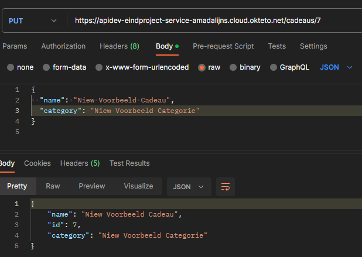

Verwijder een bestaand cadeau: 
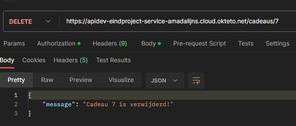

Verwijder alle cadeaus: 
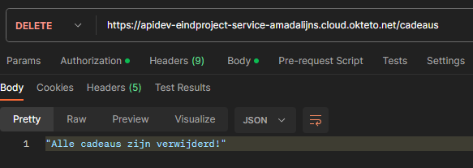

Maak een nieuwe user: 
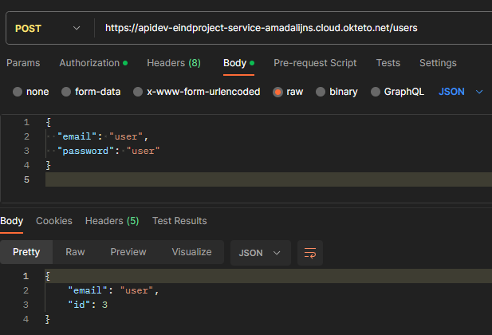

###Volledige OpenAPI Docs
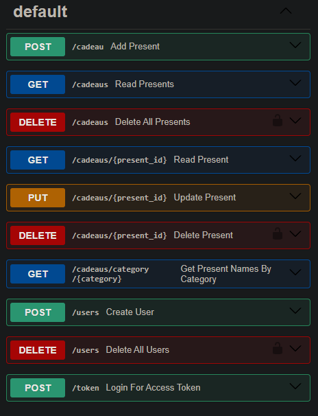
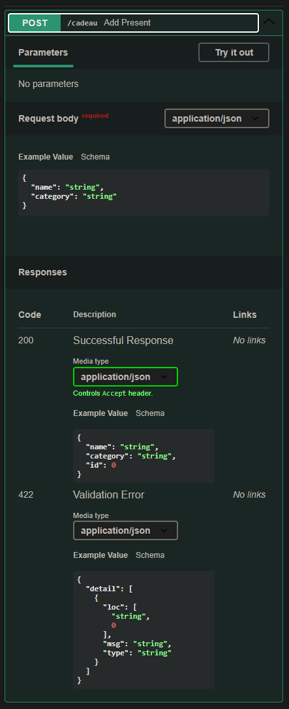
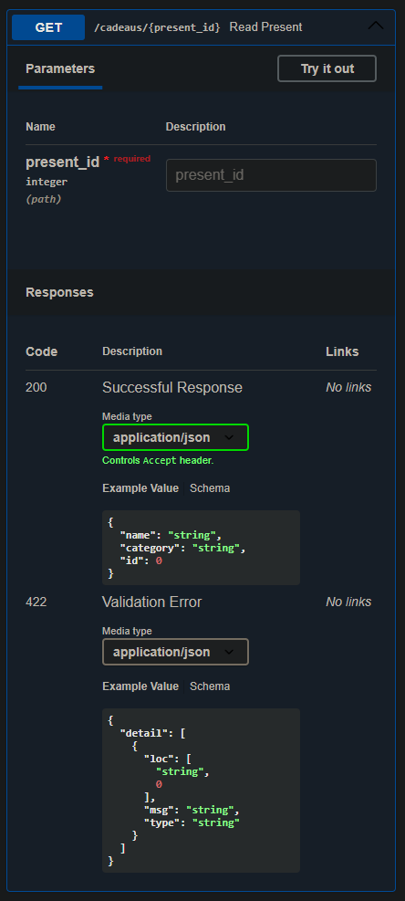
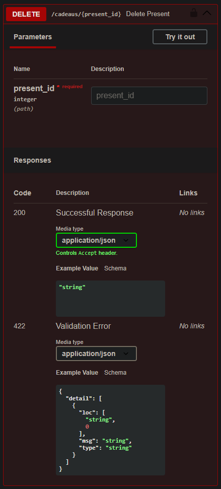

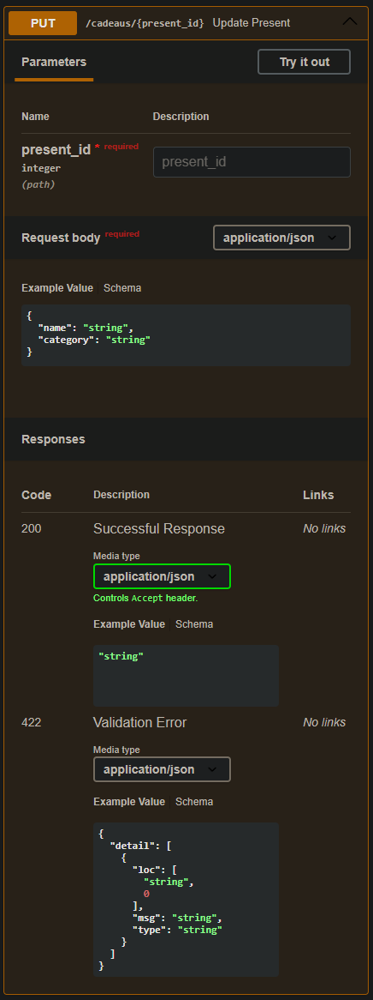
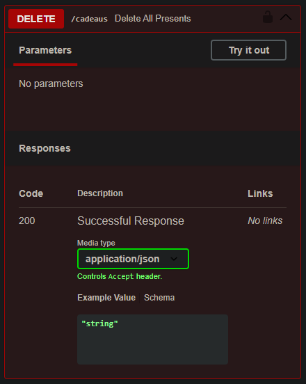

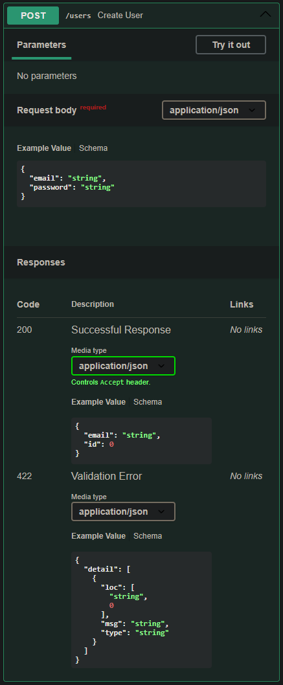
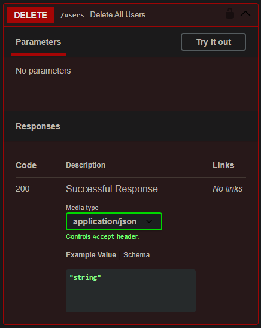
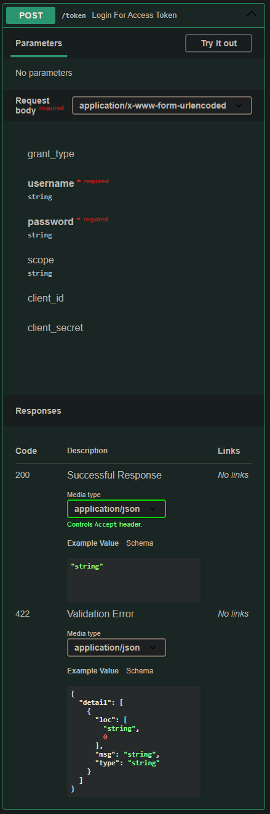
